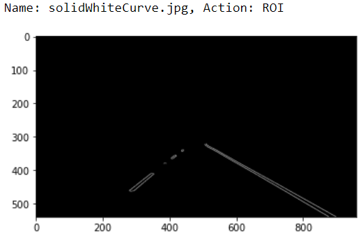

# **Finding Lane Lines on the Road**


Overview
---

When we drive, we use our eyes to decide where to go.  The lines on the road that show us where the lanes are act as our constant reference for where to steer the vehicle.  Naturally, one of the first things we would like to do in developing a self-driving car is to automatically detect lane lines using an algorithm.

In this scenario, almost every day we heard about autonomous vehicles (AV), where we see a car on the road but driverless. We can call self-driving cars.

Self-driving cars combine a variety of sensors to perceive their surroundings, such as radar, lidar, sonar, GPS, odometry and inertial measurement units. In addition, the lane lines on the road also helps to keep the car in a safety position relate to others objects in the road.

Computer vision techniques are the main tools used in this work. In this case, OpenCV provides the capabilities of sensing the surrounding environment for the detection, identification, and tracking of road lane-lines.

The target of this project is to detect lane lines on the road images using Python and [OpenCV](https://opencv.org/).

## The pipeline steps ##

To make things clear to understand and follow, this work was divided in steps:

1. Color to Gray
2. Canny Edge Detection
3. Region of Interest
4. Hough Transform
5. Draw lane lines

## 1. Color to Gray ##

We are using RGB images and videos as starting point and, in step 1 we convert the image from RGB to gray image.


The RGB image is converted to gray image using the snippet OpenCV code

```{python}
gray = grayscale(image)
```
and we get the grayed image


## 2. Canny Edge Detection ##
Now we use the Canny edge detector algorithm to detect a wide range of edges in the image, using the snippet code below.

```{python}
low_threshold = 120
high_threshold = 170
edges = canny(blur_gray, low_threshold, high_threshold)
```

We use a threshold interval of 120-170 and get the resulting image


The interval is used to remove part of the lines that has no interest to our task. Note how the image shows less lines when compared with previous image.

## 3. Region of Interest ##

But we still have a lot of lines that does not relate to lane lines. So, looking to the picture, we have a region of interest, ROI, where we have mainly the lane lines. The snippet code below can provide the ROI.

```{python}
left_bottom = [110, ysize]
right_bottom= [930, ysize]
apex1 = [450, 320]
apex2 = [510, 320]
vertices = np.array([[left_bottom, apex1, apex2, right_bottom]], dtype=np.int32)

# perform a linear fit (y=Ax+B) to each side of ROI 
masked_edges = region_of_interest(edges, vertices)
```

Note that with the 4 points we define a quadrilateral region relate to region of interest. As a result, we get the figure.




## 4. Hough Transform ##

The Hough Transform is just the conversion from image space to Hough space. So, the characterization of a line, **x** vs **y**, in image space will be a single point at the position **(m, b)** in Hough space, where **m** is the slope of the line.

```{python}
rho = 2                 # distance resolution in pixels of the Hough grid
theta = np.pi/180       # angular resolution in radians of the Hough grid
threshold = 50          # minimum number of votes (intersections in Hough grid cell)
min_line_length = 4     # minimum number of pixels making up a line
max_line_gap = 130      # maximum gap in pixels between connectable line segments
# Run Hough on edge detected image
# Output "image_hlines" is an array containing endpoints of detected line segments
himage, hlines = hough_lines(masked_edges, rho, theta, threshold, min_line_length, max_line_gap)
```


## 5. Draw lane lines ##

Now we have a good visualization of lane lines. So, what we need to do is to draw the lane lines in the original image. We can use the snippet code below.

```{python}
image_lines = weighted_img(himage, image, α=0.8, β=1., γ=0.)
print_image(image_lines, gray=False)
```


---

## Putting All Together ##

The video shows the finding lane lines in action.

[](https://youtu.be/VskUUnsZ1yY)


### Reflection

As described above, my pipeline consisted of 5 steps. Starting from converting the original image to gray scale until find a ROI with the lane lines. 

At final, in order to draw a single line on the left and right lanes, I created the `improve_lane()` function to help the draw_lines() function to better draw the lane lines when there is discontinuity at the end of both left and right lines. The function searches the Hough lines, looking to the left most and right most lines and convert them from Hough space to image space. The resulting lines are used by draw_lines() to complete the lane lines.

### Potential shortcomings of current pipeline

This process is based on certain premises like:
1. The ROI has a fixed position in the road. If the road change greatly, like a curve lines, shadows, it will be difficult to define the region of interest to draw lane lines.
2. If the car change from lane, the algorithm will draw wrong lines.

### Possible improvements to pipeline

A possible improvement would be to use radar to help the perception.

Another potential improvement could be to use lidars that has better performance than cameras.